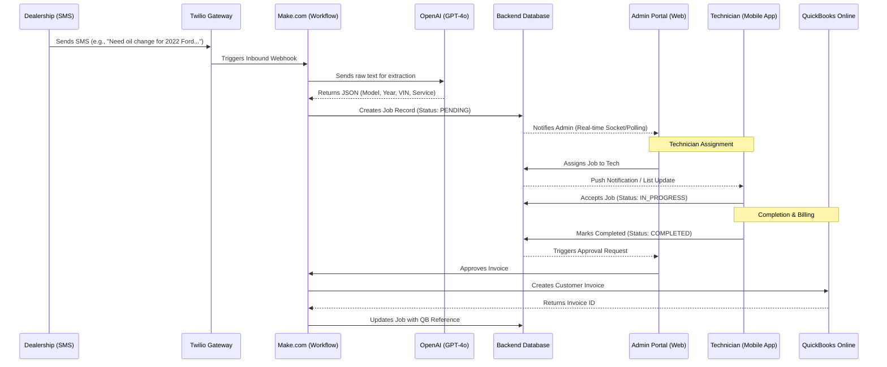

# SM2 Dispatch System: Technical & Functional Backend Specification

## 1. System Overview & UML Architecture

The SM2 Dispatch System is a distributed, event-driven platform. Below is the **Sequence Diagram** showing the end-to-end lifecycle of a job request.

### Job Lifecycle Sequence Diagram


---

## 2. Full Database Architecture (ERD Blueprint)

To build a robust system, the database must handle relationships between dealerships, technicians, and specialized services. Below is the complete schema including metadata and indexes.

### A. Primary Tables

#### **1. Jobs (The Core Transaction)**
| Field | Type | Constraint | Description |
| :--- | :--- | :--- | :--- |
| `id` | UUID | PK | Unique Job ID |
| `job_code` | String | Unique | Internal reference (e.g., SM2-2024-001) |
| `dealership_id` | UUID | FK | Link to **Dealerships** |
| `tech_id` | UUID | FK (nullable) | Assigned **Technician** |
| `service_id` | UUID | FK | Link to **Services** Catalog |
| `vehicle_data` | JSONB | Required | {year, make, model, vin, stock_no} |
| `urgency` | Enum | Required | LOW, MEDIUM, HIGH, CRITICAL |
| `ranking_score` | Integer | Optional | Calculated sorting value |
| `applied_rules` | Array[String]| Optional | List of rule descriptions applied |
| `status` | Enum | Default: PENDING | PENDING, SCHEDULED, IN_PROGRESS, COMPLETED, CANCELLED |

| `invoice_state` | Enum | Default: NOT_STARTED| PENDING_APPROVAL, SYNCED, FAILED |
| `parsing_confidence`| Float | Required | OpenAI confidence score (0-1.0) |
| `qb_invoice_id` | String | Index | QuickBooks reference ID |
| `created_at` | Timestamp | Default: now() | For reporting and sorting |
| `updated_at` | Timestamp | Auto-update | For audit tracking |

#### **2. Technicians**
| Field | Type | Description |
| :--- | :--- | :--- |
| `id` | UUID | PK |
| `name` | String | Full Name |
| `phone` | String | Primary SMS contact |
| `zone_id` | UUID | FK -> **Zones** |
| `skills` | Array[UUID]| List of Service IDs they are certified for |
| `status` | Enum | AVAILABLE, BUSY, OFFLINE, ON_LEAVE |

#### **3. Dealerships**
| Field | Type | Description |
| :--- | :--- | :--- |
| `id` | UUID | PK |
| `name` | String | Name of the shop |
| `phone` | String | Incoming SMS lookup key (Twilio `From` number) |
| `email` | String | Billing destination |
| `zone_id` | UUID | FK -> **Zones** |
| `is_audit_flagged`| Boolean | If true (e.g., Audi), all jobs require manual review |

### B. Supporting Tables (Reference Data)

#### **4. Services Catalog**
- `id`: UUID (PK)
- `code`: String (e.g., "OIL_CHANGE")
- `name`: String (Human readable)
- `base_price`: Decimal
- `requires_approval`: Boolean (Force admin check)

#### **5. Zones**
- `id`: UUID (PK)
- `name`: String (e.g., "North Quebec", "Levis")
- `description`: String

#### **6. Audit Logs (Compliance & History)**
- `id`: UUID (PK)
- `job_id`: UUID (FK)
- `actor`: String (SYSTEM, ADMIN, or TECH Name)
- `action`: String (e.g., "STATUS_CHANGE")
- `payload`: JSONB (Old vs New state)
- `created_at`: Timestamp

#### **7. Ranking Rules (Dynamic Routing)**
| Field | Type | Description |
| :--- | :--- | :--- |
| `id` | UUID | PK |
| `dealership_id` | UUID | FK -> **Dealerships** (Which dealer this applies to) |
| `service_id` | UUID | FK -> **Services** (Optional: e.g., only for 'Engine' work) |
| `target_urgency`| Enum | The urgency to set automatically (HIGH, CRITICAL, etc.) |
| `ranking_score` | Integer| Impact on sorting (Ranking value) |
| `is_active` | Boolean | Enable/Disable rule |


### C. Database Constraints & Indexing
- **Index `jobs.vin`**: Crucial for looking up vehicle history across different jobs.
- **Index `jobs.qb_invoice_id`**: For fast syncing verification.
- **Unique `dealerships.phone`**: Used to identify which dealership is texting the system.
- **FK Cascades**: If a job is deleted (rare), associated audit logs should be archived or deleted.

---

## 3. Technical Integration Details

### A. OpenAI Parsing Prompt (The "Brain")
When the SMS hits the backend, the system calls OpenAI with a System Prompt similar to this:
> "You are a professional automotive dispatcher. Extract the following from the message: Year, Make, Model, VIN, and Service requested. If the VIN is missing, look for a Stock Number. Output strictly in JSON format. Assign a confidence score between 0 and 1 based on how clear the request is."

### B. Twilio -> Make.com Payload
The webhook from Twilio provides the following core data:
```json
{
  "From": "+15551234567",
  "Body": "Need a key for a 2023 Audi Q5 VIN 12345...",
  "SmsSid": "SMxxxxxx",
  "DateSent": "2024-03-20T10:00:00Z"
}
```

### C. QuickBooks API Integration
The Make.com workflow for invoicing performs a **Search/Match** before creating:
1.  **Find Customer**: Search QBO for the dealership name.
2.  **Create Invoice**: Use the `job.id` as the reference number.
3.  **Line Items**: Map `service.name` to a QBO Item.

---

## 4. Workflow Logic Rules (Business Rules)

For a developer building the backend, implement these "Guardrails":
1.  **Dynamic Ranking Engine**: The system must allow the client (Admin) to set custom ranking rules. When a new job request is received via SMS, the backend should:
    *   Identify the **Dealership** from the phone number.
    *   Check for any active **Ranking Rules** linked to that Dealership or the parsed **Service Type**.
    *   Automatically escalate the `urgency` to `HIGH` or `CRITICAL` or adjust the **Ranking Score** if it matches a preset rule (e.g., *"Set all Engine Repairs from Audi Quebec to CRITICAL with +15 Ranking"*).

2.  **The "Audi Rule"**: Any job for an "Audi" vehicle must trigger a `HIGH` urgency flag (Ranking escalation) and require manual admin verification before being sent to a technician.

2.  **Safety Lock**: An invoice cannot be sent to QuickBooks unless the job status is `COMPLETED` and the admin has clicked the `Approve` button in the UI.
3.  **Conflict Prevention**: A technician cannot be assigned to two `IN_PROGRESS` jobs simultaneously if the zones are more than 20km apart.
4.  **Portal Separation**: Admin and Technician interfaces are strictly decoupled. No cross-role switching (e.g., "Switch to Admin View") is permitted within the Technician UI to maintain operational boundary integrity.


---

## 5. Deployment & Security Stack

### Hosting (Vercel)
-   **Frontend**: React (Vite) + Tailwind CSS.
-   **Backend Functions**: Vercel Edge Functions (Node.js/TypeScript).
-   **Environment Variables**: Securely store API keys for Twilio, OpenAI, and QuickBooks.

### Security
-   **CORS**: Only allow the production dealership domain.
-   **HMAC Validation**: Verify the `X-Twilio-Signature` on all inbound SMS webhooks to prevent spoofing.
-   **Rate Limiting**: Limit OpenAI calls per dealership to prevent API cost spikes.

---

## 6. RESTful API Endpoints (Frontend to Backend)

To ensure the frontend works correctly, the backend should expose the following core endpoints. Use **JSON Web Tokens (JWT)** for authentication.

### A. Jobs Management
- `GET /api/jobs`: Fetch all jobs with support for query filters (`status`, `dealership`, `urgency`).
- `GET /api/jobs/:id`: Fetch full details for a specific job, including the `audit_timeline`.
- `PATCH /api/jobs/:id`: Update job details (e.g., assigning a technician or updating vehicle info).
- `POST /api/jobs/:id/approve`: Admin-only endpoint to trigger the QuickBooks sync for a completed job.

### B. Technician Portal
- `GET /api/technician/jobs`: Fetch jobs assigned to the authenticated technician.
- `POST /api/technician/jobs/:id/accept`: Move job from `SCHEDULED` to `IN_PROGRESS`.
- `POST /api/technician/jobs/:id/complete`: Upload service completion data and move status to `COMPLETED`.

### C. System Config & Health
- `GET /api/system/health`: Combined status of Vercel Functions, Database, and Make.com workers.
- `GET /api/dealerships`: Fetch active dealership profiles for the dropdowns.

---

## 7. Implementation Roadmap for Future Developers
1.  **Phase 1**: Set up the PostgreSQL database and define the Zod schemas for all jobs.
2.  **Phase 2**: Configure the Twilio -> Make.com -> OpenAI loop for automated job entry.
3.  **Phase 3**: Build the Technician Mobile web interface for real-time status updates.
4.  **Phase 4**: Finalize the QuickBooks OAuth 2.0 flow for secure invoicing.
5.  **Phase 5**: Implement real-time notifications (WebSockets or Server-Sent Events) for the Admin Dashboard.

