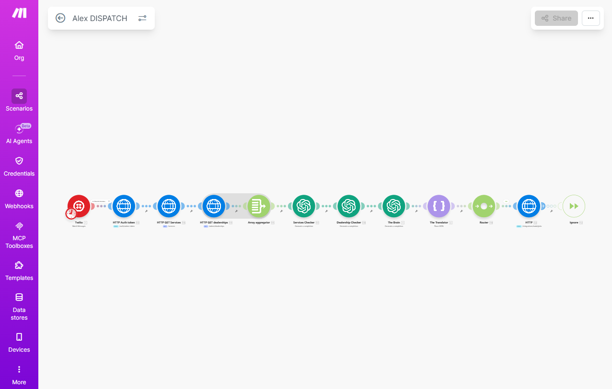

# Dispatch System

Client-Crew Dispatch is an AI-assisted dispatch platform for SMS intake, job tracking, technician scheduling, invoice approvals, and automation-driven routing.

## What this repository contains

- `app/` - the full application source
- `docs/assets/` - visual workflow assets rendered in GitHub
- `docs/backend-technical-spec.md` - backend technical specification

## Make.com Main Scenario

<p align="center">
  
</p>

This scenario powers the dispatch intake pipeline:

- Twilio receives the inbound SMS.
- Authentication and data fetch steps load services and dealerships.
- Array aggregation merges the live reference data.
- Services Checker and Dealership Checker validate the dispatch context.
- The Brain and The Translator normalize the message payload.
- Router sends the request to the correct backend branch.
- Ignore is the fallback path for messages that should not continue.

## Clean Repo Map

```text
Dispatch-System/
|-- app/
|   |-- backend/
|   `-- src/
|-- docs/
|   |-- assets/
|   |   `-- makecom-main-scenario.png
|   `-- backend-technical-spec.md
|-- README.md
`-- .gitignore
```

## Stack

- Frontend: React, Vite, TypeScript
- Backend: FastAPI, PostgreSQL
- Automation: Make.com, Twilio, OpenAI

## Docs

- [Backend Technical Specification](docs/backend-technical-spec.md)
- [Frontend README](app/README.md)
